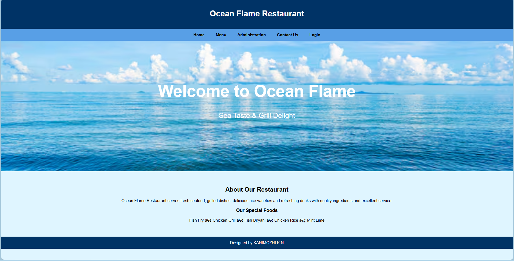
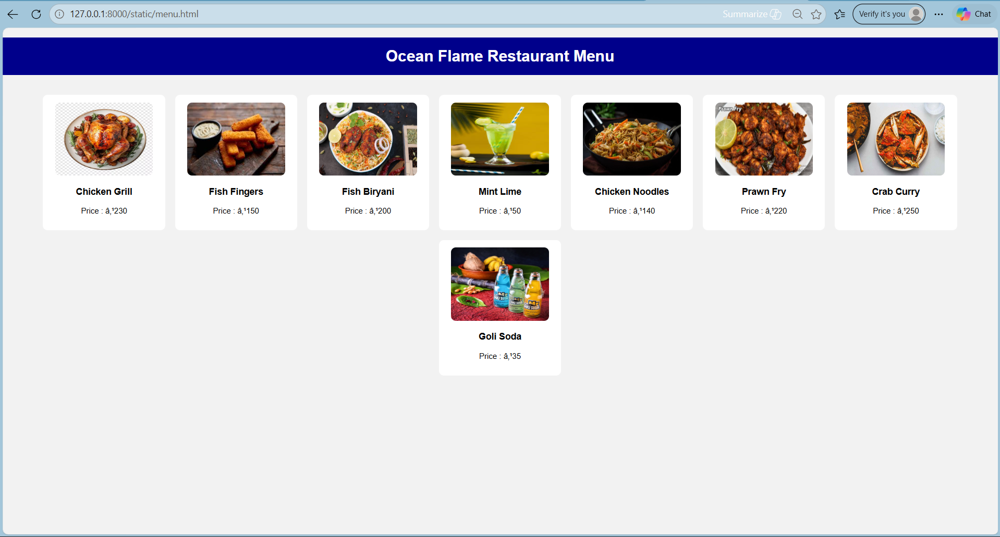
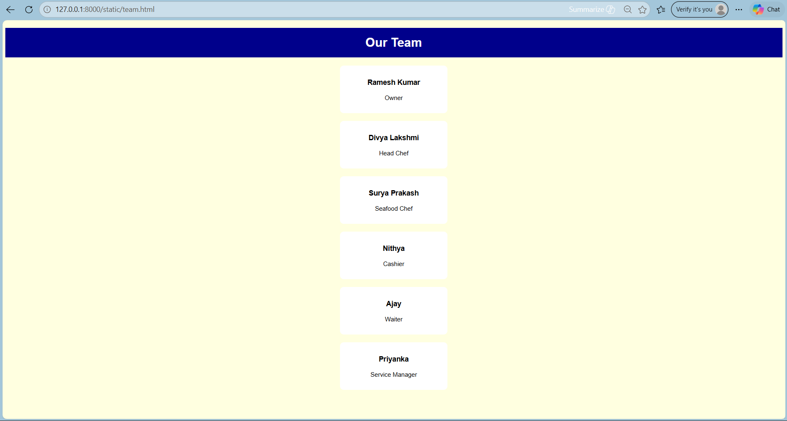
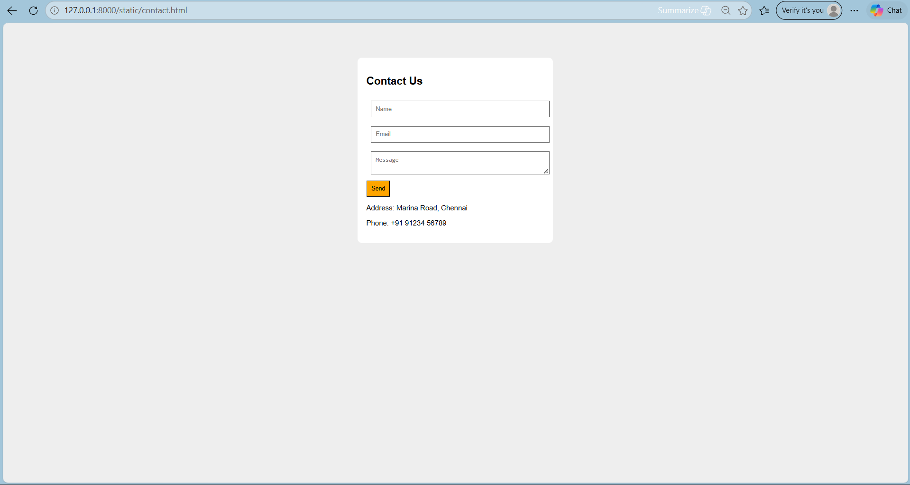

# Ex.06 Restuarant Website
## Date: 24-05-2026

## AIM:
To develop a static Resturant website to display the menu and services provided by the resturant.

## DESIGN STEPS:

### Step 1:
Requirement collection.

### Step 2:
Creating the layout using HTML and CSS.

### Step 3:
Updating the sample content.

### Step 4:
Choose the appropriate style and color scheme.

### Step 5:
Validate the layout in various browsers.

### Step 6:
Validate the HTML code.

### Step 7:
Publish the website in the given URL.

## PROGRAM:
LOGIN.HTML:
```
<!DOCTYPE html>
<html>
<head>
<title>Ocean Flame Restaurant</title>

<style>

body{
margin:0;
font-family:Arial;
background-color:#dff5ff;
}

header{
background-color:#003366;
color:white;
padding:20px;
text-align:center;
}

nav{
background-color:#589fe6;
padding:15px;
text-align:center;
}

nav a{
text-decoration:none;
color:black;
margin:20px;
font-weight:bold;
}

.banner{
background-image:url("oceanbg.avif");
background-size:cover;
background-position:center;
height:400px;
text-align:center;
color:white;
padding-top:120px;
}

.banner h1{
font-size:65px;
font-weight:bold;
}

.banner p{
font-size:28px;
}

.content{
text-align:center;
padding:40px;
}

footer{
background-color:#003366;
color:white;
text-align:center;
padding:15px;
}

</style>

</head>

<body>

<header>

<h1>Ocean Flame Restaurant</h1>

</header>

<nav>

<a href="index.html">Home</a>

<a href="menu.html">Menu</a>

<a href="team.html">Administration</a>

<a href="contact.html">Contact Us</a>

<a href="login.html">Login</a>

</nav>

<div class="banner">

<h1>Welcome to Ocean Flame</h1>

<p>Sea Taste & Grill Delight</p>

</div>

<div class="content">

<h2>About Our Restaurant</h2>

<p>

Ocean Flame Restaurant serves fresh seafood, grilled dishes,
delicious rice varieties and refreshing drinks with quality
ingredients and excellent service.

</p>

<h3>Our Special Foods</h3>

<p>

Fish Fry • Chicken Grill • Fish Biryani • Chicken Rice • Mint Lime

</p>

</div>

<footer>

Designed by KANIMOZHI K N

</footer>

</body>
</html>

```

MENU.HTML:
```
<!DOCTYPE html>
<html>
<head>
<title>Menu</title>

<style>

body{
font-family:Arial;
background:#f2f2f2;
margin:0;
}

h1{
background:darkblue;
color:white;
padding:20px;
text-align:center;
}

.container{
display:flex;
flex-wrap:wrap;
justify-content:center;
gap:20px;
padding:20px;
}

.card{
background:white;
width:220px;
padding:15px;
text-align:center;
border-radius:10px;
}

.card img{
width:200px;
height:150px;
border-radius:10px;
}

</style>

</head>

<body>

<h1>Ocean Flame Restaurant Menu</h1>

<div class="container">

<div class="card">

<h3>Chicken Grill</h3>
<p>Price : ₹230</p>
</div>

<div class="card">

<h3>Fish Fingers</h3>
<p>Price : ₹150</p>
</div>

<div class="card">

<h3>Fish Biryani</h3>
<p>Price : ₹200</p>
</div>

<div class="card">

<h3>Mint Lime</h3>
<p>Price : ₹50</p>
</div>

<div class="card">

<h3>Chicken Noodles</h3>
<p>Price : ₹140</p>
</div>

<div class="card">

<h3>Prawn Fry</h3>
<p>Price : ₹220</p>
</div>

<div class="card">

<h3>Crab Curry</h3>
<p>Price : ₹250</p>
</div>

<div class="card">

<h3>Goli Soda</h3>
<p>Price : ₹35</p>
</div>

</div>

</body>
</html>

```

TEAM.HTML:
```
<!DOCTYPE html>
<html>
<head>

<title>Team</title>

<style>

body{
font-family:Arial;
background:lightyellow;
}

h1{
text-align:center;
background:darkblue;
color:white;
padding:20px;
}

.box{
background:white;
width:250px;
margin:20px auto;
padding:15px;
text-align:center;
border-radius:10px;
}

</style>

</head>

<body>

<h1>Our Team</h1>

<div class="box">
<h3>Ramesh Kumar</h3>
<p>Owner</p>
</div>

<div class="box">
<h3>Divya Lakshmi</h3>
<p>Head Chef</p>
</div>

<div class="box">
<h3>Surya Prakash</h3>
<p>Seafood Chef</p>
</div>

<div class="box">
<h3>Nithya</h3>
<p>Cashier</p>
</div>

<div class="box">
<h3>Ajay</h3>
<p>Waiter</p>
</div>

<div class="box">
<h3>Priyanka</h3>
<p>Service Manager</p>
</div>

</body>
</html>

```

CONTACT.HTML:
```
<!DOCTYPE html>
<html>
<head>

<title>Contact</title>

<style>

body{
font-family:Arial;
background:#eee;
}

.box{
width:400px;
margin:auto;
margin-top:80px;
background:white;
padding:20px;
border-radius:10px;
}

input,textarea{
width:95%;
padding:10px;
margin:10px;
}

button{
padding:10px;
background:orange;
}

</style>

</head>

<body>

<div class="box">

<h2>Contact Us</h2>

<form>

<input type="text"
placeholder="Name">

<input type="email"
placeholder="Email">

<textarea placeholder="Message">
</textarea>

<br>

<button>Send</button>

</form>

<p>
Address: Marina Road, Chennai
</p>

<p>
Phone: +91 91234 56789
</p>

</div>

</body>
</html>

```

## OUTPUT:

LOGIN PAGE:



MENU PAGE:



TEAM PAGE:



CONTACT PAGE:



## RESULT:
The program for designing software company website using HTML and CSS is completed successfully.
